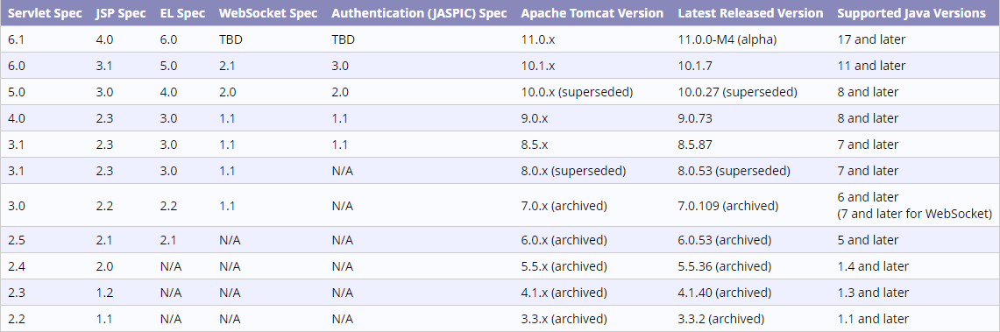

# bookstore

使用Servlet的一个demo

## 用到的技巧

1、使用注解代替web.xml中的映射

使用xml:
```xml
    <servlet>
        <servlet-name>UserServlet</servlet-name>
        <servlet-class>com.breeze.bookstore.web.UserServlet</servlet-class>
    </servlet>
    <servlet-mapping>
        <servlet-name>UserServlet</servlet-name>
        <url-pattern>/user</url-pattern>
    </servlet-mapping>
```

使用注解：
```java
@WebServlet("/user")
```

## 项目启动

完成以下配置后，指定项目的ApplicationContext，访问：http://localhost:8080/bookstore/index.html

接口的请求格式为：http://localhost:8080/shoppingCart?method=

### Install dependency

```mvn
mvn install:install-file -Dfile=itcast-tools-1.4.2.jar -DgroupId=cn.itcast -DartifactId=itcast-tool -Dversion=1.4.2 -Dpackaging=jar
```

引入了czbk对itcast-tools.jar，对service的请求进行了封装

### 如果出现访问jstl页面异常
```log
The absolute uri: [http://java.sun.com/jsp/jstl/core] cannot be resolved in either web.xml or the jar files deployed with this application
```
jsp页面使用了jstl包的标签库，但是无法找到`<%@ taglib prefix="c" uri="http://java.sun.com/jsp/jstl/core" %>`

拷贝jstl-1.2.jar到tomcat服务器的lib目录中，重新启动

### 如果项目无法访问@WebServlet注解的地址

错误信息：404，请求资源不可用，无法找到目标资源

1、查看`metadata-complete`属性是否是false，默认值是 false，即默认启用 Servlet 注解支持，所以默认情况下，使用该注解时，不必创建 web.xml 文件。
   * metadata-complete取值为true，表示关闭注解支持 
   * metadata-complete取值为true，表示启用注解支持

```xml
<web-app xmlns="http://xmlns.jcp.org/xml/ns/javaee"
         xmlns:xsi="http://www.w3.org/2001/XMLSchema-instance"
         xsi:schemaLocation="http://xmlns.jcp.org/xml/ns/javaee http://xmlns.jcp.org/xml/ns/javaee/web-app_4_0.xsd"
         version="4.0" metadata-complete="false"><!--基于注解式-->
</web-app>
```

注意：不要同时配置注解和配置式，如果同时使用且web.xml中配置的servlet-name属性和@WebServlet注解属性name一样，则会忽略注解中的配置。

2、使用注解，version需大于3.0，排查tomcat版本和web.xml申明version，以及使用javax-servlet-api.jar版本和支持的jstl版本等

servlet各版本和tomcat支持的映射关系：[官网](https://tomcat.apache.org/whichversion.html)



> 注意：tomcat 同时支持 servlet 4 与jsp2.3 不意味这 jsp2.3就支持servlet4.0
> 事实上， jsp2.3.3 仅支持 servlet 3.0.1，如果弄错了，是会出bug的
> servlet 3.1 jdk至少1.7 tomcat 8.5

各版本web.xml的写法：

web.xml——version2.3——JDK1.3——Tomcat4.1
```xml
<?xml version="1.0" encoding="ISO-8859-1"?>  
<!DOCTYPE web-app PUBLIC "-//Sun Microsystems, Inc.//DTD Web Application 2.3//EN" "http://java.sun.com/dtd/web-app_2_3.dtd">  
<web-app>  
   
</web-app> 
```

web.xml——version2.4——JDK1.4——Tomcat5.5
```xml
<?xml version="1.0" encoding="UTF-8"?>  
<web-app id="WebApp_9" version="2.4" xmlns="http://java.sun.com/xml/ns/j2ee"   
    xmlns:xsi="http://www.w3.org/2001/XMLSchema-instance"  
    xsi:schemaLocation="http://java.sun.com/xml/ns/j2ee http://java.sun.com/xml/ns/j2ee/web-app_2_4.xsd">  
   
</web-app>  
```

web.xml——version2.5——JDK5.0——Tomcat6.0
```xml
<?xml version="1.0" encoding="UTF-8"?>  
<web-app xmlns="http://java.sun.com/xml/ns/javaee"  
xmlns:xsi="http://www.w3.org/2001/XMLSchema-instance"  
xsi:schemaLocation="http://java.sun.com/xml/ns/javaee http://java.sun.com/xml/ns/javaee/web-app_2_5.xsd"  
version="2.5">  
</web-app>  
```

web.xml——version3.0——JDK6.0——Tomcat7.0
```xml
<?xml version="1.0" encoding="UTF-8"?>  
<web-app  
        version="3.0"  
        xmlns="http://java.sun.com/xml/ns/javaee"  
        xmlns:xsi="http://www.w3.org/2001/XMLSchema-instance"  
        xsi:schemaLocation="http://java.sun.com/xml/ns/javaee http://java.sun.com/xml/ns/javaee/web-app_3_0.xsd">  
</web-app>
```

web.xml——version3.1——JDK7.0——Tomcat8.0,Tomcat8.5
```xml
<?xml version="1.0" encoding="UTF-8"?>
<web-app xmlns:xsi="http://www.w3.org/2001/XMLSchema-instance" xmlns="http://xmlns.jcp.org/xml/ns/javaee" xsi:schemaLocation="http://xmlns.jcp.org/xml/ns/javaee http://xmlns.jcp.org/xml/ns/javaee/web-app_3_1.xsd" id="WebApp_ID" version="3.1">
</web-app>

```

```xml
<?xml version="1.0" encoding="UTF-8"?> 
<!DOCTYPE xml>
<web-app  
        version="4.0"
        xmlns="http://xmlns.jcp.org/xml/ns/javaee"
        xmlns:xsi="http://www.w3.org/2001/XMLSchema-instance"
        xsi:schemaLocation="http://xmlns.jcp.org/xml/ns/javaee
        http://xmlns.jcp.org/xml/ns/javaee/web-app_4_0.xsd">    
</web-app>
```

<hr/>

[Servlet教程](http://c.biancheng.net/servlet2/webservlet.html)